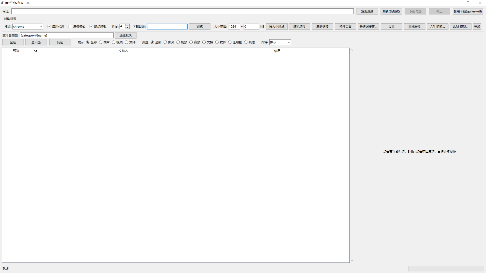

# webscoop · 网站资源批量抓取与下载工具

> 把网页里的 **图片、视频、音频、文档** 一键抓到本地。基于 Python，提供图形界面、命令行与 REST API 三种用法；内置完整反爬应对（TLS 指纹、代理池、Playwright 渲染、登录态 Cookie 注入），并对抖音 / 快手 / 小红书 / B站等「页面空壳 + 签名接口」平台做了专项适配。

## 核心功能

- **一键发现**：自动提取页内资源直链，流式上屏、分页跟随、详情页高清图跟进，预览勾选批量下载；
- **平台适配器**（抖音/快手/小红书/B站）：命中平台自动「渲染 + 捕获签名接口 + 提取直链」，支持分享短链；B 站取 DASH 流（默认封顶 1080p）；
- **智能下载**：MIME 类型识别 + 按分类落盘、文件名模板、断点续载、失败重试；支持 **m3u8 分片合并（含 AES-128 解密）**；
- **全局下载存档**：已下载 URL 持久化，定时跟进博主主页只抓新增；404 死链自动记录跳过；
- **反爬应对**：curl_cffi TLS 指纹、代理池自动吊销换址、429 退避、Scrapling 第三层兜底、登录态 Cookie 注入（按域名隔离）；
- **扩展能力**：热点模式（B站/抖音热榜）、关键词搜索、**定时跟进**（关注列表自动重发现）、Pexels API、gallery-dl 备用下载（1400+ 站）、LLM 高清规则、VLC 在线预览；
- **统计**：任务写 `stats.json`（成功/失败/耗时分桶），失败明细落 `failures.json` 可一键重试。



## ⬇️ 下载 Windows 版

[点击下载 Windows 版（免安装，解压即用）](https://github.com/xiong529/webscoop/releases/latest)

> 最新 Release 提供 `webscoop.exe`（单文件，双击直接运行）与 `webscoop-vX.Y.Z-win-x64.zip`。
> 视频预览需安装 [VLC](https://www.videolan.org/)；EXE 已内置 Playwright 驱动。
> Linux 用户可选 `.tar.gz` / `.deb` 包。

## 安装（源码运行，Python 3.10+）

```bash
git clone https://github.com/xiong529/webscoop.git
cd webscoop
python -m venv .venv && .venv\Scripts\activate   # Linux/macOS: source .venv/bin/activate
pip install -r requirements.txt
pip install -e .                                 # 安装 webscoop 命令（可选）
python -m playwright install chromium            # 渲染模式需要
python gui.py                                    # 启动图形界面
```

Windows 也可直接双击 `start.bat`（自动建环境、装依赖并启动；依赖源自动按官方/清华/阿里云回退）。

## 使用方式

### 🔲 图形界面（GUI）

1. 输入网址 → **「发现资源」**，列表流式上屏，勾选后 **「下载勾选」** 即按分类保存；
2. JS 动态站点勾选 **渲染模式**；需要登录态的站点用 **「登录抓 Cookie…」** 弹窗保存；
3. 抓不到内置解析的站用 **「备用下载(gallery-dl)」**；批量追更用 **「定时跟进…」**；
4. 命令行全站深度爬取：`scrapy crawl resource -a start_urls="https://example.com"`。

### ⌨️ 命令行（无头，无需 tkinter / 显示器）

```bash
webscoop discover https://www.douyin.com/user/xxx            # 发现并打印资源（--json 供脚本）
webscoop download https://www.douyin.com/video/xxx -o ./out  # 发现并下载
webscoop follow add https://www.douyin.com/user/xxx          # 加入定时跟进列表
webscoop follow list / remove / clear
webscoop follow run -i 30 -o ./out                           # 无头定时跟进（Ctrl+C 停止）
webscoop serve -p 8000                                       # REST API 服务
webscoop gui                                                  # 等价于 python gui.py
webscoop doctor                                               # 无头自检（依赖就绪度）
```

### 🌐 REST API（仅绑定 127.0.0.1；建议设置令牌）

```bash
RESOURCES_API_TOKEN=my-token webscoop serve -p 8000
```

```bash
POST /api/discover  {"urls": ["https://www.douyin.com/user/xxx"]}   → {"task_id": "discover-..."}
POST /api/download  {"task_id": "discover-...", "outdir": "./out"}  → {"task_id": "download-..."}
GET  /api/tasks/{id}   → 任务进度与资源列表（discover 任务含 resources）
GET  /api/tasks        → 全部任务快照        GET /api/stats → 累计统计
GET  /api/health       → {"ok": true, "version": "1.0.8"}
```

请求需带 `X-Api-Token` 头（或 `?token=`）；token 为空则本机免密。iOS 快捷指令 / crontab / 脚本均可调用。

### ⚙️ 主要设置项（环境变量可覆盖）

下载目录 `RESOURCES_INFO_DIR`、代理 `RESOURCES_PROXY`、文件名模板 `RESOURCES_FILENAME_TEMPLATE`、
重试 `RESOURCES_RETRY_TIMES`、代理池 `RESOURCES_PROXY_POOL`、并发 `RESOURCES_HLS_WORKERS` 等，详见 `config.py`。

## 测试

```bash
python tests/run_all.py    # 全量回归（单元 + 端到端，共 19 套）
python tests/run_all.py unit
```

## 项目结构

```
webscoop/
├── gui.py                  # 图形界面（懒加载，无头环境不依赖 tkinter）
├── cli.py                  # 命令行入口（discover/download/follow/serve/doctor）
├── server.py               # REST API（stdlib 实现，零新增依赖）
├── headless.py             # 无头核心：任务注册表（CLI/API 共用）
├── gui_crawler.py          # 发现与下载核心
├── gui_fetch.py            # 统一 HTTP 层（TLS 指纹 + Scrapling 兜底）
├── discover_common.py      # 分类 / MIME / 高清变换 / 模板
├── renderer.py             # Playwright 渲染 + 接口捕获
├── platform_adapters/      # 平台适配器（一平台一模块，自动注册）
├── format_selector.py      # 格式选择器（best[height<=1080]）
├── hls_downloader.py       # m3u8 分片下载（AES-128 解密）
├── download_archive.py     # 下载存档 / dead_list.py 死链表
├── hot_search.py           # 热搜榜 / follow_list.py 定时跟进
├── resources_reptile/      # Scrapy 工程
├── scripts/changelog_gen.py  # 发版 changelog 生成
└── tests/                  # 19 套回归测试
```

## 许可证

[MIT License](LICENSE)，可自由使用、修改与分发。

## 合规声明

本工具仅用于合法用途。请确认目标网站允许抓取，遵守其 robots.txt 与服务条款。
登录态 Cookie 仅保存在本地 `cookies.txt`，不会上传任何服务。